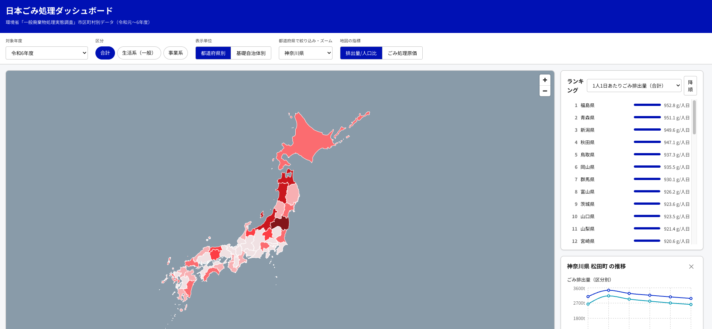

# 日本ごみ処理ダッシュボード

環境省「一般廃棄物処理事業実態調査」の公開データをもとに、都道府県・市区町村別のごみ排出量・リサイクル率・処理原価を地図とランキングで可視化するダッシュボードです。



- 地図：都道府県別コロプレス／基礎自治体別バブルマップ（[国土地理院ベクトルタイル](https://cyberjapandata.gsi.go.jp/)の行政界を重ね合わせ）
- ランキング：リサイクル率・排出量・最終処分率・処理原価など指標を切り替え可能
- 推移グラフ：都道府県・市区町村ごとの経年推移（令和元〜6年度）

完全に静的なサイトです（バックエンドサーバー不要）。データは事前に SQLite → JSON に変換して `frontend/public/data/` に書き出し、フロントエンドがそれを直接 fetch します。

## 構成

```
data/            環境省の元データ（Excel、リポジトリには含まれない）
backend/
  etl.py           Excel → SQLite (backend/waste.db)
  export_static.py SQLite → 静的JSON (frontend/public/data/)
  app.py           ローカル確認用の任意の FastAPI サーバー（本番では未使用）
frontend/          React + Vite + TypeScript + MapLibre GL のフロントエンド
```

## データを更新する

```bash
venv/bin/python backend/etl.py
venv/bin/python backend/export_static.py
cd frontend && npm run build
```

`data/*.xlsx` を新しい年度のものに差し替えてから上記を実行し、`frontend/public/data/` の変更をコミット・pushしてください。

## 開発

```bash
cd frontend
npm install
npm run dev
```

バックエンドサーバーの起動は不要です（`frontend/public/data/` の静的JSONを直接読みます）。

## ライセンス

[MIT License](LICENSE)。ただし環境省の元データの著作権・利用条件は環境省の定めるところによります。

## お問い合わせ

X: [@ponsllc](https://x.com/ponsllc)
